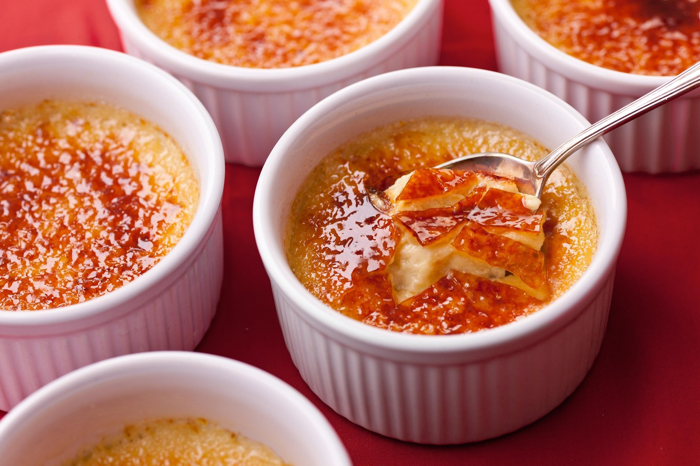
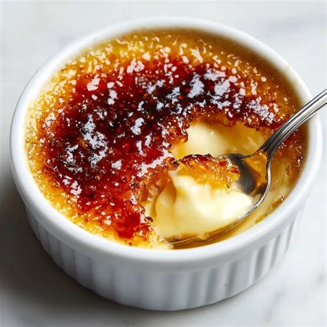

## Ingredients
* 2 egg yolks
* 200 ml heavy cream (>33%)
* 1-2 tablespoons sugar, to taste
* 20-30g brown sugar (cover)
* Aromatics (lavender, vanilla, ...)
* Ramekins or other oven and flame safe bowls

## Instructions
Whisk egg yolks with normal sugar, can be mildly foamy. Heat oven to 150 degrees Celsius. 
Boil cream with aromatics. Whisk sugar and egg yolk mixture while slowly pouring the hot cream through a sieve (you can skip the sieve if there's nothing to sieve out) to temper the eggs. Pour mixture into ramekins. 
Pour hot water into a deep baking tray, just enough to cover the bottom and some, but not too much so that it would overflow into the ramekins (physics applies, when you add ramekins, the water level goes up) and add the hot/warm ramekins with the mixture. Carefully put into the oven and leave there for at least 30 minutes. After that, start checking the crème brûlée texture regularly (every 10 minutes). It should be only minimally jiggly. When ready, put out of the oven and leave to cool completely. Use a blast chiller if you are a professional (but if so, why are you reading this recipe?!?). 
Before serving, cover the surface of each crème brûlée with an even layer of brown sugar and slowly melt and caramelize with a flame torch. With your free hand, rotate the ramekins by touching the bottom part of your ramekins; the top gets hot. Keep your hand out of the flame. Avoid burning the caramel, don't point your flame at a single spot for too long and jiggle the flame at least a bit. The sugar should eventually get liquid, at which point you can spread it around by tilting the ramekin. 

## Notes
The more egg white you in the mixture, the worse the final texture. 
You can scale this recipe up. People tend to prefer ramekins that are not too filled. 

This one is slightly overcooked, but nice: 

This one is fucked: 

This one is okay: 
