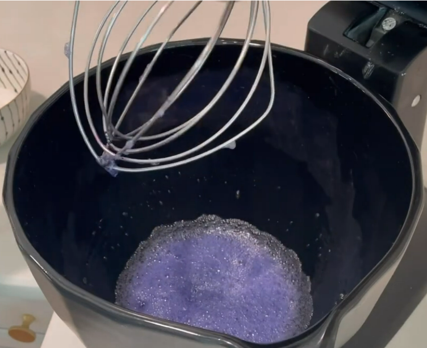
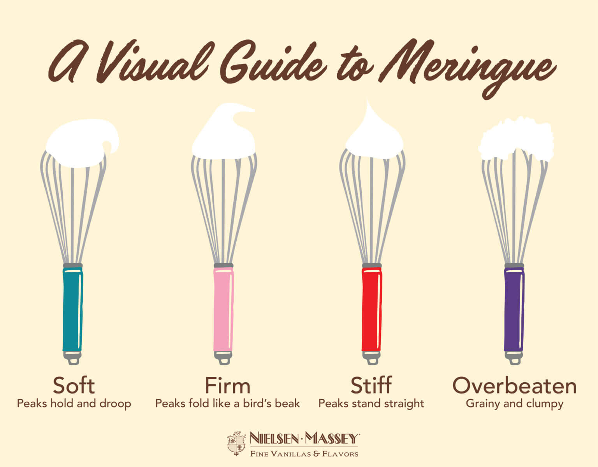
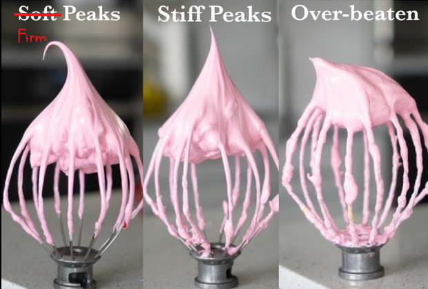

## Equipment
* Precise kitchen scale
* Stand mixer/kitchen robot with a whisk attachment
* Fine mesh sieve
* Silicone spatula
* #12 round piping tip (cca 8mm)
* Piping bags
* 2 silicone baking mats, with the macaron circles or baking paper
* 2 baking trays
* Bowls
* Optional but recommended: oven thermometer

## Ingredients
* 105g egg whites, aged
* 144g almond flour
* 125g powdered sugar
* 105g granulated or caster sugar
* flavouring (spices, extracts, powders...)
* coloring (powder or gel)
* White vinegar, isopropyl alcohol (IPA) or other high-content tasteless food-safe alcohol

## Instructions

### Prepare egg whites
Separate egg whites (3 eggs, you can adjust other ingredients based on this by doing (ingredient amount)/105 x (current egg white weight)) and cover with a towel. Let them sit out overnight or in the fridge overnight or put them in the microwave for 5s, three times.  
Either way, your egg whites *must* be at a room temperature when you're using them.  

### Prepare dry ingredients (tant pour tant)
Mix almond flour and powdered sugar, sift twice. Some people pulse them in a food processor a few times. Some people add dry, powdery flavourings like freeze-dried fruits or spices or lemon zest to the dry ingredients.  
Traditionally, the ratio should be 1:1 powdered sugar to almond flour. People have been adjusting the ratios however.  

### Meringue
If you have powder coloring, add it to your egg whites at the start.  
Start whipping the egg whites on medium/low medium speed until they are foamy/frothy.  

Some people add cream of tartar or lime juice or salt to help the meringue stabilise.  

Slowly and gradually add the sugar, waiting for it to dissolve. Some people add it in thirds, some pour it very slowly, some add it spoon by spoon, letting each batch dissolve. I like to scrape the sides with the spatula to make sure no undissolved sugar stays on the sides.  
Switch to medium-high speed until you reach the soft peaks stage. To check, stop the mixer, take off the whisk, swirl it in the bowl and bring it up. This is when you want to add gel coloring, vanilla or other flavouring. Be careful with liquid flavouring, too much can ruin the meringue.  

Beat until the meringue is glossy and stiff. The whipping time can vary a lot, depending on your mixer and the speed and many other factors. Meringue can be overmixed, once it starts separating into chunks it's over.  

[False positive](https://www.youtube.com/watch?v=dpyX0iSwHuU&t=7m28s) 
[Stiff peaks](https://www.youtube.com/watch?v=dpyX0iSwHuU&t=9m35s) 

### Macronage
TODO 
Wipe down a silicone baking mat, set it on a baking tray.  
Sift the dry ingredients into the meringue. Mix them in, then switch to folding. This is the tricky part, you need to fold in 'J' shapes, rotating the bowl as you go, making sure to get things from the bottom and sides, until the macronage flows off the spatula in ribbons (like thick lava) instead of falling off in chunks. The ribbons should also sit on top of it for ~10s instead of melting in. It should be smooth and glossy. There are various tricks and tips and tests available. Some people smear the batter against the bowl sides to get rid of big bubbles. Some do a figure-8 test to see if it's ready.  
Go watch a few videos to understand the desired consistency. It's better to undermix.  
Prepare a piping bag with a round piping tip (tip #12 ~8mm, or something close to it). Load the macronage in and pipe onto the sheet. If you've never done this, I suggest you watch a video. Slam the tray on the counter a couple of times to help flattening the macarons and to get rid of air bubbles. 
You can also use a toothpick to pop any bubbles that stay after this, and smooth the aftermath of said bubbles.  
If your macarons have tips, you've undermixed the macronage. Dip your finger in water, gently pat them down and expect sticky bottoms. If your macarons spread a lot, the macronage is overmixed and there's no fixing it.  
Stick some elderflower blooms (without the green parts, just the tiny blossoms) on about half of the shells. Let the shells sit for 30-60min, until they develop a skin and are no longer sticky. Preheat the oven to 135°C.  
Bake for 23 minutes, rotating halfway through. If you are using a silicone mat, leave them in for longer and on a slightly lower temperature. Let them cool on the mats.  

## Notes
It's recommended to wipe down everything that comes in contact with the macronage to remove dust and oils. Use IPA or the vinegar. Generally, vinegar works great for plastic, silicone and glass surfaces, but the metal ones seem to get a bit dissolved in it, so I switched to IPA for that. I'd try without the IPA, my dishwasher works just fine and a little bit of fat is actually okay and won't ruin the macronage according to [this dude](https://www.seriouseats.com/is-it-true-not-to-get-yolk-in-egg-whites).  
It is highly recommended you use a kitchen robot for the meringue.  
Ideally you own at least one silicon sheet with pre-drawn macaron circles. If not, print two papers with the circles and put that under a sheet of baking paper to guide your piping. Don't forget to remove the papers before baking. Or eyeball it. You might need another person to safely transfer it to a tray.  
This amount will make 2-3 baking trays. Have a plan for if you have leftover macronage after piping two trays. It cannot stay in the bag, it'll degrade. 
For filling, one can use a flavored buttercream, chocolate ganache, jam, or some other slightly stiffer filling. Things like mascarpone with whipped cream will make them soggy overtime.  